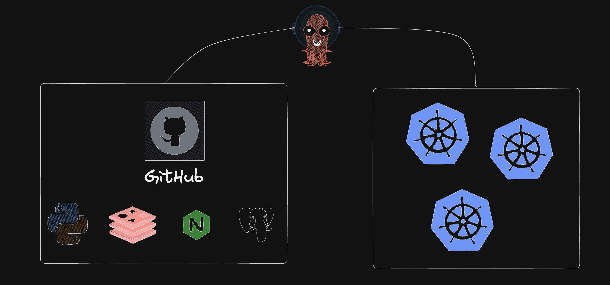

# Deploying an App on Kubernetes with ArgoCD

A beginner-friendly learning project that walks you through deploying a real application on a local Kubernetes cluster (KIND) using ArgoCD for continuous delivery.

**What you will learn:**
- How to containerize a Node.js app with Docker
- How to create a local Kubernetes cluster using KIND
- What Kubernetes Deployments and Services are
- How ArgoCD implements GitOps (Git as the source of truth)
- How to access your app running inside Kubernetes

---

## How It All Works (Big Picture)



The diagram above shows the core GitOps flow:
1. Your app code and K8s manifests live in **GitHub**
2. **ArgoCD** watches the repo and detects any changes
3. ArgoCD automatically syncs those changes into the **Kubernetes cluster**

In text form:

```
You push code to GitHub
        |
        v
   ArgoCD watches
   your GitHub repo
        |
        v
ArgoCD detects changes
and syncs them to the
  Kubernetes cluster
        |
        v
 Your app is updated
  inside Kubernetes
        |
        v
 You access it at
 localhost:8080
```

This pattern is called **GitOps** — Git is the single source of truth for what should be running in your cluster. ArgoCD continuously reconciles the cluster state to match what is in Git.

---

## Project Structure

```
K8s_with_ArgoCD/
│
├── app/                        # The application code
│   ├── index.js                # Simple Node.js Express web server
│   ├── package.json            # Node.js dependencies
│   ├── Dockerfile              # Instructions to build the container image
│   └── .dockerignore           # Files to exclude from the Docker image
│
├── k8s/                        # Kubernetes manifests (what to deploy)
│   ├── deployment.yaml         # Tells K8s how to run the app
│   └── service.yaml            # Tells K8s how to expose the app
│
├── argocd/                     # ArgoCD configuration
│   └── application.yaml        # Tells ArgoCD where the repo is and what to deploy
│
├── kind-config.yaml            # KIND cluster configuration
└── README.md                   # This file
```

---

## Prerequisites

Install these tools before starting. Click the links for installation instructions.

| Tool | What it does | Install |
|------|-------------|---------|
| Docker | Runs containers | [docker.com/get-started](https://www.docker.com/get-started/) |
| KIND | Creates a K8s cluster inside Docker | [kind.sigs.k8s.io](https://kind.sigs.k8s.io/docs/user/quick-start/#installation) |
| kubectl | CLI to talk to Kubernetes | [kubernetes.io/docs/tasks/tools](https://kubernetes.io/docs/tasks/tools/) |
| ArgoCD CLI (optional) | CLI to interact with ArgoCD | [argo-cd.readthedocs.io](https://argo-cd.readthedocs.io/en/stable/cli_installation/) |

Verify everything is installed:

```bash
docker --version
kind --version
kubectl version --client
```

You also need:
- A **GitHub account** (to host this repo)
- A **Docker Hub account** (to host your container image) — sign up free at [hub.docker.com](https://hub.docker.com)

---

## Step-by-Step Setup

### Step 1 — Fork and Clone This Repo

Fork this repository to your own GitHub account, then clone it:

```bash
git clone https://github.com/YOUR_GITHUB_USERNAME/K8s_with_ArgoCD.git
cd K8s_with_ArgoCD
```

> **Why fork?** ArgoCD needs to read from *your* Git repo. If you use someone else's repo, you cannot push changes to test the GitOps flow.

---

### Step 2 — Build and Push the Docker Image

First, log in to Docker Hub:

```bash
docker login
```

Build the image (replace `your-dockerhub-username` with your actual username):

```bash
docker build -t your-dockerhub-username/hello-k8s:latest ./app
```

Test it locally to make sure it works:

```bash
docker run -p 3000:3000 your-dockerhub-username/hello-k8s:latest
# Open http://localhost:3000 in your browser — you should see the app
# Press Ctrl+C to stop
```

Push it to Docker Hub so Kubernetes can pull it:

```bash
docker push your-dockerhub-username/hello-k8s:latest
```

> **What is Docker Hub?** It's a public registry for container images. Kubernetes needs to pull your image from somewhere — Docker Hub is the easiest option for learning.

---

### Step 3 — Update the Image Name in the Deployment

Open `k8s/deployment.yaml` and replace the placeholder image name:

```yaml
# Change this line:
image: YOUR_DOCKERHUB_USERNAME/hello-k8s:latest

# To this (with your actual username):
image: johndoe/hello-k8s:latest
```

Also open `argocd/application.yaml` and update the repo URL:

```yaml
# Change this line:
repoURL: https://github.com/YOUR_GITHUB_USERNAME/K8s_with_ArgoCD

# To this:
repoURL: https://github.com/johndoe/K8s_with_ArgoCD
```

Commit and push these changes:

```bash
git add .
git commit -m "update image name and repo URL"
git push
```

---

### Step 4 — Create the KIND Cluster

```bash
kind create cluster --name argocd-demo --config kind-config.yaml
```

Verify the cluster is running:

```bash
kubectl cluster-info
kubectl get nodes
```

You should see one node with status `Ready`.

> **What is KIND?** KIND stands for Kubernetes IN Docker. It runs a full Kubernetes cluster inside Docker containers on your machine. Perfect for learning and local development.

---

### Step 5 — Install ArgoCD

Create a namespace for ArgoCD and install it:

```bash
kubectl create namespace argocd

kubectl apply -n argocd -f https://raw.githubusercontent.com/argoproj/argo-cd/stable/manifests/install.yaml
```

Wait for all ArgoCD pods to be ready (this takes about 1-2 minutes):

```bash
kubectl wait --for=condition=Ready pods --all -n argocd --timeout=120s
```

Check that all pods are running:

```bash
kubectl get pods -n argocd
```

You should see pods like `argocd-server`, `argocd-repo-server`, `argocd-application-controller`, etc. — all in `Running` state.

> **What is ArgoCD?** ArgoCD is a GitOps continuous delivery tool for Kubernetes. It watches your Git repository and automatically applies any changes to your cluster.

---

### Step 6 — Access the ArgoCD Web UI

ArgoCD runs inside your cluster. To access its web UI, forward a local port to it:

```bash
kubectl port-forward svc/argocd-server -n argocd 8081:443
```

Open [https://localhost:8081](https://localhost:8081) in your browser.

> Your browser will show a security warning because ArgoCD uses a self-signed certificate. Click "Advanced" → "Proceed" to continue.

**Get the initial admin password:**

```bash
kubectl get secret argocd-initial-admin-secret -n argocd \
  -o jsonpath="{.data.password}" | base64 -d && echo
```

Log in with:
- **Username:** `admin`
- **Password:** (the output from the command above)

---

### Step 7 — Deploy Your App with ArgoCD

Apply the ArgoCD Application manifest:

```bash
kubectl apply -f argocd/application.yaml
```

This tells ArgoCD:
- Where your Git repo is
- Which folder has the K8s manifests (`k8s/`)
- Where to deploy (the same cluster, `default` namespace)

ArgoCD will now:
1. Connect to your GitHub repo
2. Read the files in the `k8s/` folder
3. Apply `deployment.yaml` and `service.yaml` to your cluster

Watch it sync in the ArgoCD UI at [https://localhost:8081](https://localhost:8081).

You can also check from the terminal:

```bash
kubectl get pods -n default
kubectl get svc -n default
```

---

### Step 8 — Access Your App

Your app is now running inside Kubernetes! Open it in your browser:

```
http://localhost:8080
```

You should see the "Hello from Kubernetes!" page showing the pod name it's running on.

> **Why localhost:8080?** The `kind-config.yaml` file maps port `30000` on the cluster node to port `8080` on your machine. The `service.yaml` exposes the app on NodePort `30000`.

---

## Test the GitOps Flow

This is the fun part — watch ArgoCD automatically update your app when you push to Git.

1. Change something in `app/index.js` (e.g., change the message text)
2. Rebuild and push a new Docker image:
   ```bash
   docker build -t your-dockerhub-username/hello-k8s:latest ./app
   docker push your-dockerhub-username/hello-k8s:latest
   ```
3. Trigger a rollout so Kubernetes pulls the new image:
   ```bash
   kubectl rollout restart deployment/hello-k8s -n default
   ```
4. Refresh [http://localhost:8080](http://localhost:8080) — you should see your changes

> **Note for production:** In a real pipeline, you would update the image tag in `deployment.yaml` (e.g., `:v2`) and push to Git. ArgoCD detects the change in Git and rolls out the update automatically. Using `:latest` is convenient for learning but not recommended for production.

---

## Understanding the Key Files

### `app/Dockerfile`
Defines how to package your app into a container image. Every line is commented to explain what it does.

### `k8s/deployment.yaml`
Tells Kubernetes to run 2 copies (replicas) of your app container. If one crashes, Kubernetes automatically restarts it.

### `k8s/service.yaml`
Creates a stable network endpoint for your app. Since pod IP addresses change, the Service provides a fixed way to reach the pods.

### `argocd/application.yaml`
Registers your app with ArgoCD. From this point on, ArgoCD watches your Git repo and keeps the cluster in sync.

### `kind-config.yaml`
Configures the local KIND cluster with a port mapping so you can access the app from your browser.

---

## Useful Commands Reference

```bash
# Cluster
kind create cluster --name argocd-demo --config kind-config.yaml
kind delete cluster --name argocd-demo
kubectl get nodes

# Pods and Deployments
kubectl get pods
kubectl get deployments
kubectl describe pod <pod-name>
kubectl logs <pod-name>

# Scale the app up or down
kubectl scale deployment hello-k8s --replicas=3

# Restart the deployment (forces a new image pull)
kubectl rollout restart deployment/hello-k8s

# ArgoCD port-forward (run in a separate terminal)
kubectl port-forward svc/argocd-server -n argocd 8081:443

# See ArgoCD apps from CLI
argocd app list
argocd app sync hello-k8s
argocd app get hello-k8s
```

---

## Cleanup

To delete everything and start fresh:

```bash
# Delete the KIND cluster (removes everything inside it too)
kind delete cluster --name argocd-demo
```

---

## Troubleshooting

**Pods are in `ImagePullBackOff` or `ErrImagePull`**
Your image name in `deployment.yaml` is wrong or the image wasn't pushed to Docker Hub. Double-check the image name and run `docker push` again.

**ArgoCD app shows `OutOfSync`**
This is normal if ArgoCD hasn't synced yet. Click "Sync" in the UI, or run `argocd app sync hello-k8s`.

**Can't access localhost:8080**
Make sure you created the cluster with `--config kind-config.yaml`. If you created it without the config, delete and recreate it.

**ArgoCD shows `ComparisonError` or can't clone repo**
Make sure the `repoURL` in `argocd/application.yaml` matches your actual GitHub repo URL and that the repo is public.
